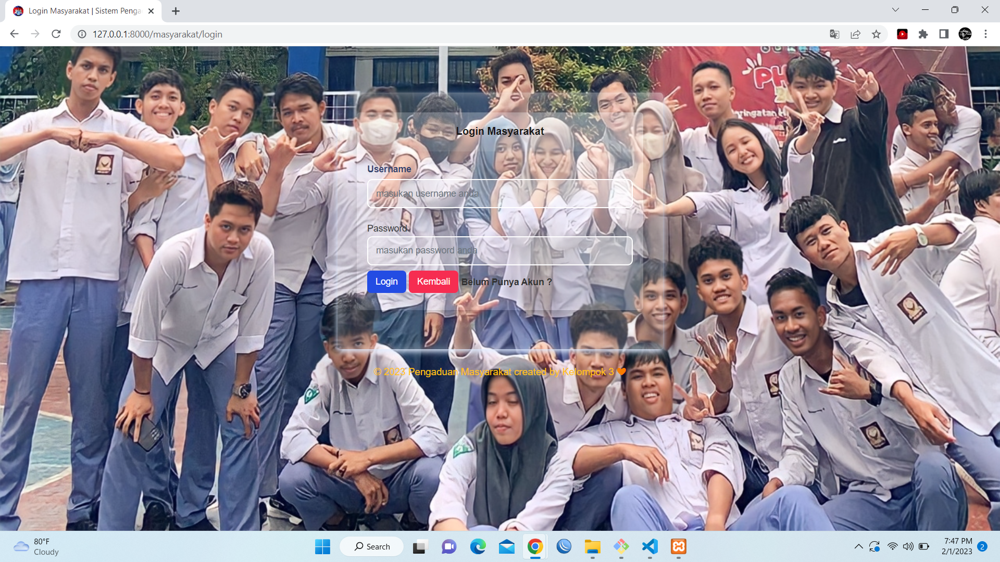
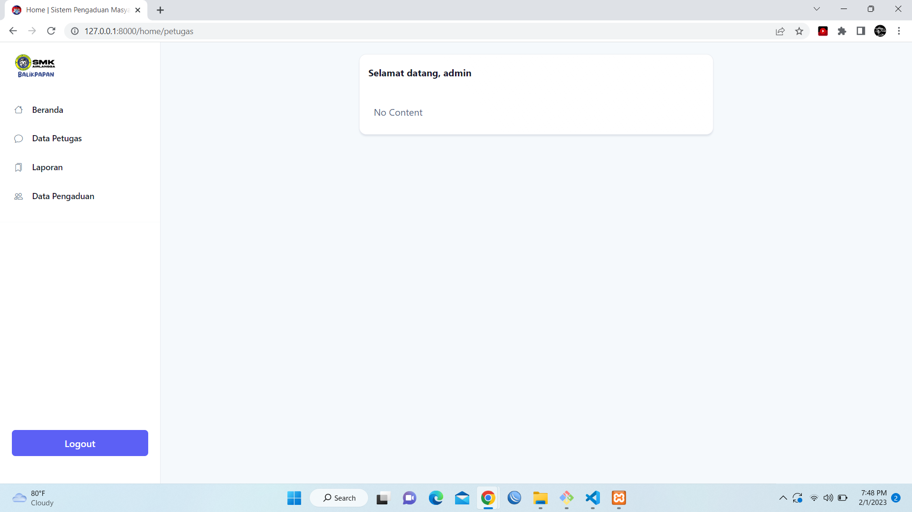

<p align="center"><a href="https://laravel.com" target="_blank"></a></p>

<h1 align="center">
    Pengaduan Masyarakat
  <br>
</h1>            

# Intro

hallo

# overview project




## Prerequiste

- [Composer](https://getcomposer.org/) - Download and Install Composer

### Installation

Install the dependencies and start the server.

```sh
$ git clone https://github.com/adityaferdi77/tugas-pengaduan.git
$ open directory project
$ composer install
$ cp .env.example to .env
$ change setting for database & generate key with php artisan key:generate
$ Call Action to Migrate Database & seeder with php artisan migrate --seed
$ php artisan serve
```

## Framework for Development

- [Laravel](https://laravel.com/)
- [Bootstrap](https://getbootstrap.com/)


## The Project is MIT licensed.

2023 © Adedya Ferdy Anur
